## Maurício Vancine

::::: columns
::: {.column width="40%"}
<center>
<br><br>

</center>
:::

::: {.column width="60%"}
-   Ecólogo e Doutor em Ecologia
-   Pós-Doc em Ecologia Espacial (Mathias Pires - Unicamp)
-   Ecologia Espacial
-   Modelagem Ecológica
-   Análise de Dados Geoespaciais
-   Ecologia e Conservação de Anfíbios
-   *Open source* \[R, QGIS, GRASS GIS, GNU/Linux\]
:::
:::::

::: footer
[mauriciovancine.github.io](https://mauriciovancine.github.io)
:::

## Análises Ecológicas no R (2022)

::::: columns
::: {.column width="50%"}
<br>
<center>

</center>
:::

::: {.column width="50%"}
::: {style="font-size: 80%;"}
<br>

-   **15 capítulos**: linguagem R, tidyverse, questões em ecologia, análises univariadas, multivariadas e espaciais
-   [bookdown](https://analises-ecologicas.com/)
-   [PDF](https://canal6.com.br/livreacesso/livro/analises-ecologicas-no-r/)
-   [Amazon](https://www.amazon.com.br/An%C3%A1lises-ecol%C3%B3gicas-Ferdo-Rodrigues-Silva/dp/857917564X/ref=sr_1_1?keywords=9788579175640&qid=1654379366&sr=8-1)
-   [Code](https://github.com/paternogbc/livro_aer)
-   [YouTube](https://www.youtube.com/channel/UCLSVSCnmvf2k6OoWZCnEO4w)
:::
:::
:::::

::: footer
[Da Silva et al. (2022)](https://analises-ecologicas.com/)
:::

## Ensino de R no Brazil (2026)

::: {style="font-size: 70%;"}
**Oecologia Australis - Special Issue**\
*Teaching Ecology: Challenges and Possibilities*
:::

**THE CHALLENGES AND NUANCES OF TEACHING THE R PROGRAMMING LANGUAGE TO ECOLOGISTS**

::: {style="font-size: 55%;"}
Maurício Humberto Vancine, Pavel Dodonov, Bruno Vilela, Luisa Diele-Viegas, Victor Casagrande Souza, Felipe Alvarez Silva Nunes, Ana Julia Oliveira Silva, Beatriz Milz, Cristina A. Kita, Marco A. R. Mello, Renata L. Muylaert
:::

::: {style="font-size: 70%;"}
- R como ferramenta essencial na Ecologia
- Desafios no ensino para estudantes de Biologia e Ecologia
- Importância da infraestrutura e fundamentos antes do aprendizado
- Dificuldades com conceitos abstratos e interpretação de resultados
- Impactos da COVID-19 e da IA no ensino
- Formação de profissionais com fortes habilidades analíticas
:::

::: footer
[Vancine et al. (2026)](https://revistas.ufrj.br/index.php/oa/article/view/64848)
:::

## Artigo da Mata Atlântica (2024)

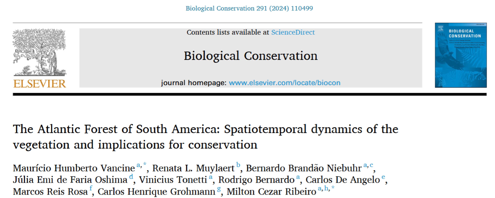{.absolute width=60% right=400 top=100}
{.absolute width=40% right=550 top=360}
{.absolute width=30% right=100 top=230}

::: footer
[Vancine et al. (2024)](https://doi.org/10.1016/j.biocon.2024.110499)
:::

## IMPORTANTE!!!

**Estamos num espaço seguro e amigável**

Sintam-se à vontade para me interromper e tirar dúvidas

<center>
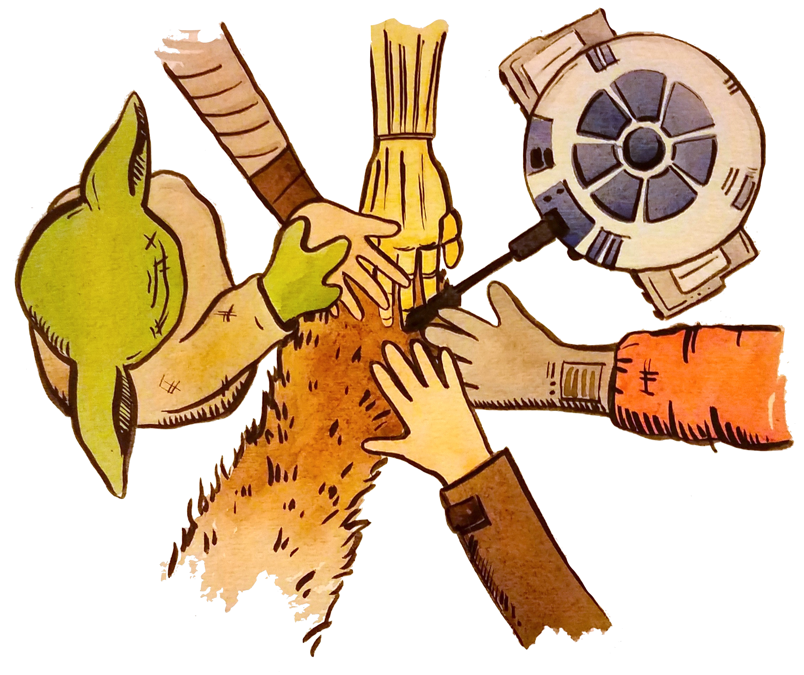
</center>

::: footer
[\@allison_horst](https://twitter.com/allison_horst)
:::

# Conteúdo 

## Conteúdo {.smaller}

::: columns
::: {.column width="50%"}
::: nonincremental
### Teoria
- Geoprocessamento
- Cartografia
- *Global Positioning System* (GPS)
- Sensoriamento Remoto
- Sistema de Informação Geográfico (SIG)
- Dados vetoriais
- Dados matriciais (raster)
- Conversão de dados geoespaciais 
- Fontes de dados geoespaciais
:::
:::

::: {.column width="50%"}
::: nonincremental
### Prática
- Principais pacotes no R
- Tipos de objetos
- Importar
- Visualizar
- Reprojetar
- Operações (extração de dados, reamostragem, máscara e buffer)
- Mapas
:::
:::
:::

## Material

Todo o material está disponível no [GitHub](https://github.com/mauriciovancine/talk-r-geospatial)

<center>

</center>

:::footer
[GitHub](https://github.com/mauriciovancine/talk-r-geospatial)
:::

# Teoria

## Geoprocessamento

Entender os **padrões espaciais** como o ambiente físico, fenômenos climáticos, humanos, sociais ou econômicos, a partir de dados **dados espaciais** para gerar **informações espaciais**

<center>
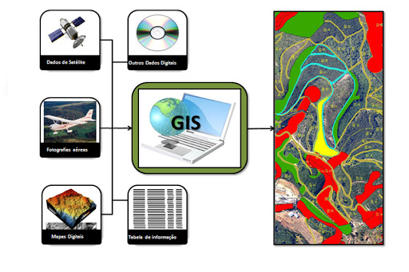
</center>

:::footer
[Xavier-da-Silva (2009)](http://www.ufrrj.br/lga/tiagomarino/artigos/oqueegeoprocessamento.pdf)
:::

## Geoprocessamento (Elementos)

1. Cartografia digital (CD)
1. *Global Positioning System* (GPS)
1. Sensoriamento Remoto (RS)
1. Sistemas de Informações Geográficas (SIG)

<center>
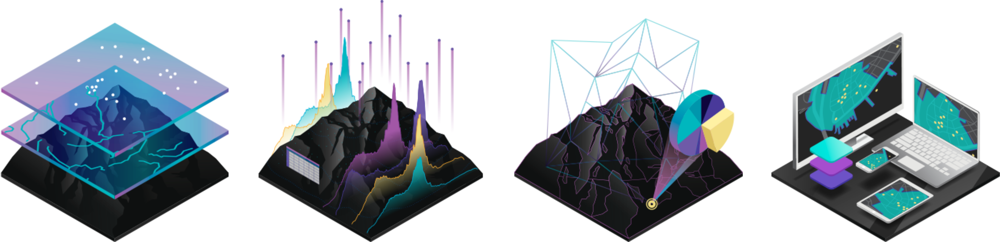
</center>

:::footer
[Xavier-da-Silva (2009)](http://www.ufrrj.br/lga/tiagomarino/artigos/oqueegeoprocessamento.pdf)
:::

## Cartografia

### Escala

Relação entre a **medida gráfica** (representado no papel ou computador) e a **medida real** (objeto ou lugar)

::: columns 
::: {.column width="60%"}
::: nonincremental

- d (distância gráfica): 0,01 m (1 cm)
- D (distância real): 250 m

- E (escala) = d / D = 0,01 m / 250 m
- E = 1/25.000 ou 1:25.000

<center>
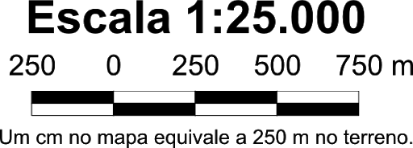
</center>

:::
:::

::: {.column width="40%"}
<center>
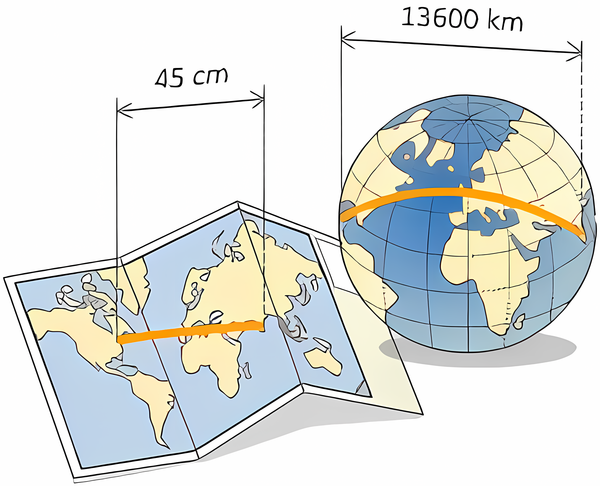
</center>
E = 0,45/13.600.000  
E = 1/30.000.000
:::
:::

## Cartografia {.smaller}

### Sistema de coordenadas geográficas (graus)

::: columns
::: {.column width="40%"}
**1. Graus, minutos e segundos**

Longitude: 42°42'42" O

Latitude: 23°23'23" S

<br>

**2. Graus decimais**

Longitude: -42.71167

Latitude: -23.38972

<br>

**Conversão** 

42 + (42/60) + (42/3600) = 42.71167

23 + (23/60) + (23/3600) = 23.38972
:::

::: {.column width="60%"}
<br><br>
<center>
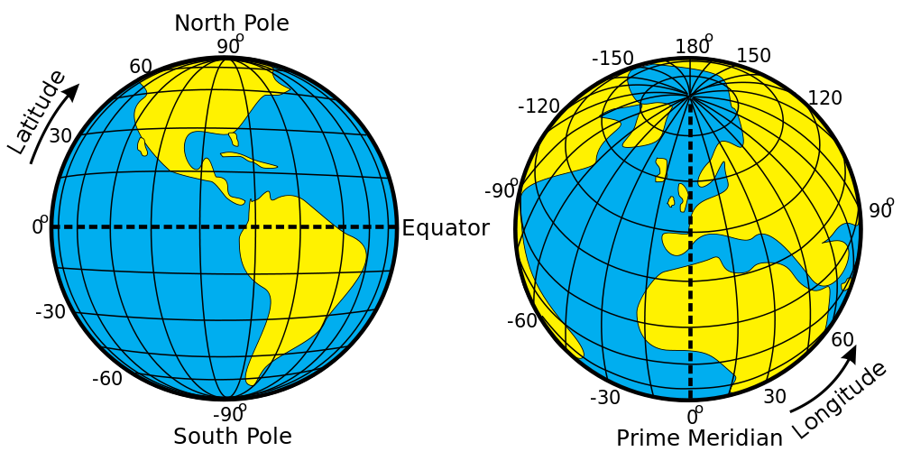
</center>
:::
:::

:::footer
[5 Themes of Geography](https://express.adobe.com/page/WXwQFzH7DqYAw/)
:::

## Cartografia {.smaller}

### Sistema de coordenadas projetadas (metros)

::: columns
::: {.column width="50%"}
<br>
<center>
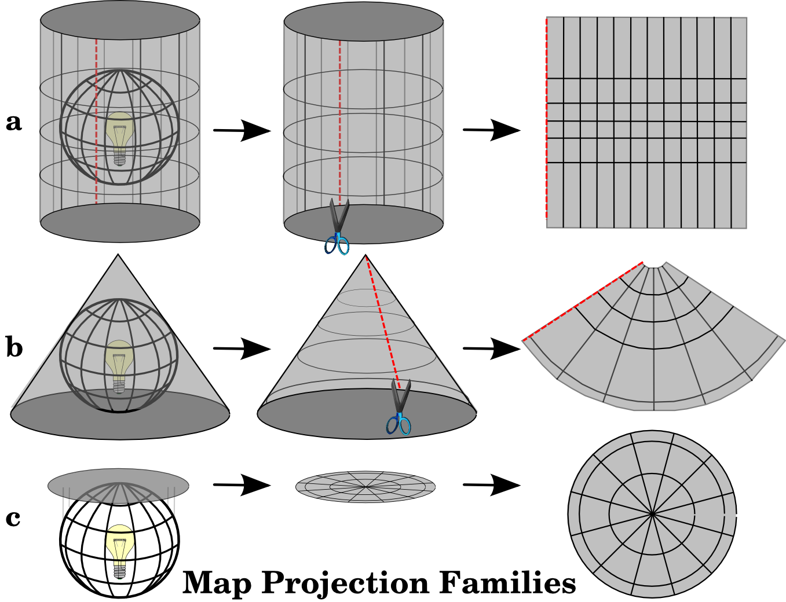
</center>
:::

::: {.column width="50%"}
<center>
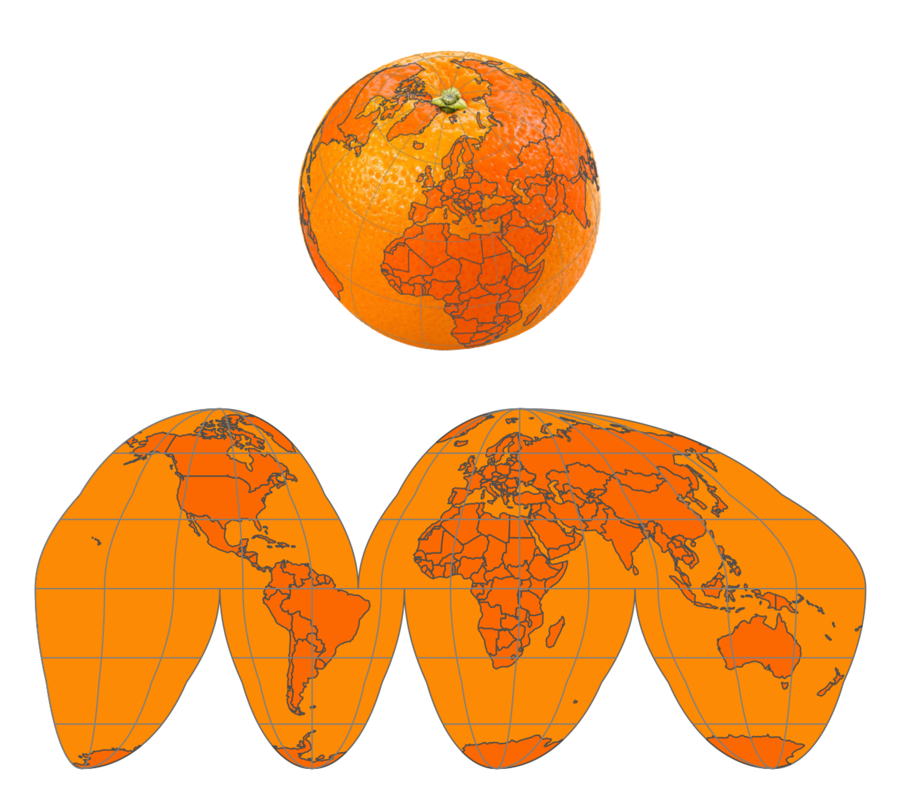
</center>
:::
:::

:::footer
[Guia do Usuário QGIS](https://docs.qgis.org/3.22/pt_BR/docs/gentle_gis_introduction/coordinate_reference_systems.html), [Tennekes & Nowosad (in prep.)](https://r-tmap.github.io/tmap-book/index.html)
:::

## Cartografia {.smaller}

### Sistema de coordenadas projetadas (metros)

::: columns
::: {.column width="30%"}
**Universal Transversa de Mercator (UTM)**

X UTM: 706832 m E

Y UTM: 4344683 m N

Zona: 10S
:::

::: {.column width="70%"}
<br><br><br>
<center>
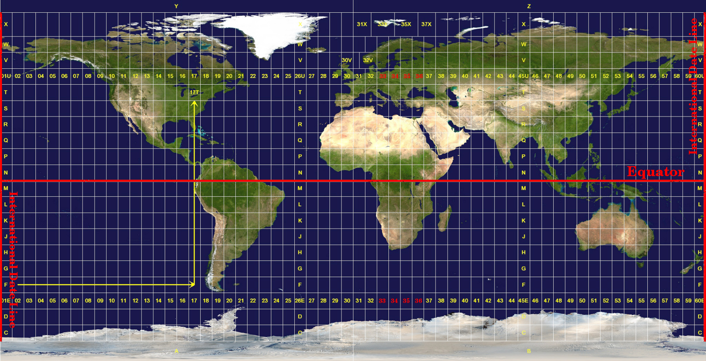
</center>
:::
:::

:::footer
[Guia do Usuário QGIS](https://docs.qgis.org/3.22/pt_BR/docs/gentle_gis_introduction/coordinate_reference_systems.html)
:::

## Cartografia {.smaller}

### Datum

Relação do sistema de coordenadas com a superfície da Terra

::: columns
::: {.column width="30%"}
<br>

**1. Geocêntricos**

WGS84

SIRGAS2000

<br>

**2. Topocêntricos**

SAD69

Córrego Alegre
:::

::: {.column width="70%"}
<br><br>
<center>
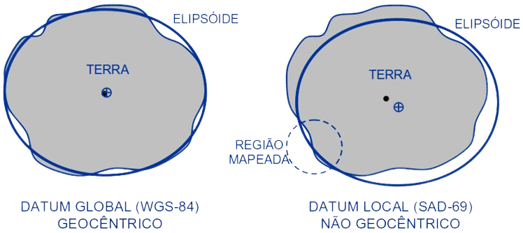
</center>
:::
:::

:::footer
[Cartografia para Geoprocessamento](http://www.geomatica.eng.uerj.br/docentes/araujo/cartografia_para_geoprocessamento)
:::

## Cartografia {.smaller}

### Sistema de Referência de Coordenadas (SRC)

Datum + Sistema de Coordenadas (geográfico ou projetado)

<center>
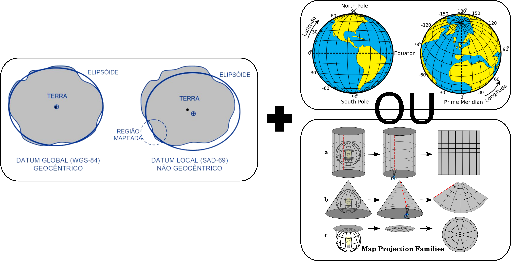
</center>

:::footer
[5 Themes of Geography](https://express.adobe.com/page/WXwQFzH7DqYAw/), [Cartografia para Geoprocessamento](http://www.geomatica.eng.uerj.br/docentes/araujo/cartografia_para_geoprocessamento), [Guia do Usuário QGIS](https://docs.qgis.org/3.22/pt_BR/docs/gentle_gis_introduction/coordinate_reference_systems.html)
:::

## Cartografia

### EPSG (*European Petroleum Survey Group*)

<br><br>

::: columns
::: {.column width="65%"}
- EPSG:4326 ([WGS84 + Geográfico](https://epsg.io/4326))
- EPSG:4674 ([SIRGAS2000 + Geográfico](https://epsg.io/4674))
- EPSG:32723 ([WGS84 + UTM23S](https://epsg.io/32723))
- EPSG:31983 ([SIRGAS2000 + UTM23S](https://epsg.io/31983))
:::

::: {.column width="35%"}
<br><br><br><br><br>
<center>

</center>
:::
:::

:::footer
[epsg.io](https://epsg.io/)
:::

## *Global Positioning System* (GPS)

Indica uma localização no planeta através de pontos ou linhas

<br>

::: columns
::: {.column width="40%"}

- **Satélites**: localização e altitude
- **Tipos de dados**: waypoint, route e track
- **Formatos**: .gpx e .kml ou .kmz 
:::

::: {.column width="60%"}
<center>
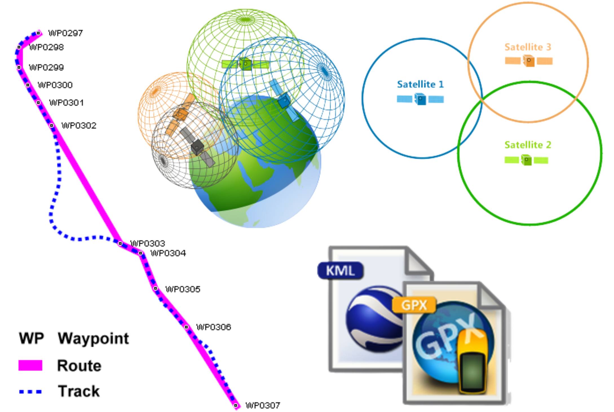
</center>
:::
:::

:::footer
[Como funciona o GPS?](https://www.electricalelibrary.com/2018/03/23/como-funciona-o-gps/), [GPS Exchange Format](https://en.wikipedia.org/wiki/GPS_Exchange_Format), [Conversor Online para KML e GPX](https://www.clickgeo.com.br/conversor-online-kml-gpx/), [Global Positioning System](https://en.wikipedia.org/wiki/Global_Positioning_System)
:::

## *Global Positioning System* (GPS)

Indica uma localização no planeta através de pontos ou linhas

<br>

::: columns
::: {.column width="40%"}

- **Satélites**: localização e altitude
- **Tipos de dados**: waypoint, route e track
- **Formatos**: .gpx e .kml ou .kmz 
:::

::: {.column width="60%"}
<center>
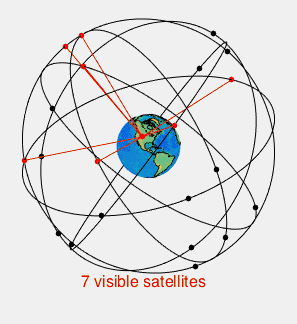
</center>
:::
:::

:::footer
[Zanotta et al. (2019)](https://www.ofitexto.com.br/livro/processamento-de-imagens-de-satelite/)
:::

## Sensoriamento Remoto

Obtenção de informações de algo na Terra sem contato físico

<center>
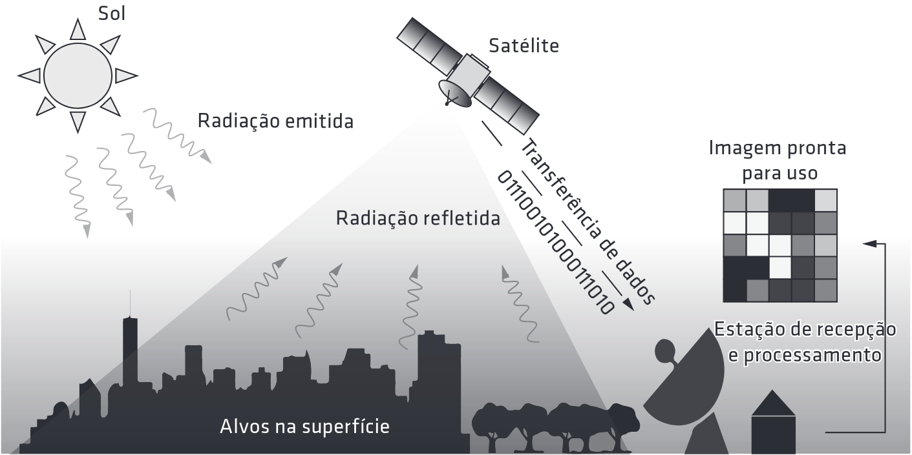
</center>

:::footer
[Zanotta et al. (2019)](https://www.ofitexto.com.br/livro/processamento-de-imagens-de-satelite/)
:::

---

### Sistema de Informação Geográfica (SIG/GIS)

Conjunto de procedimentos utilizados para armazenar e manipular dados georeferenciados

<center>
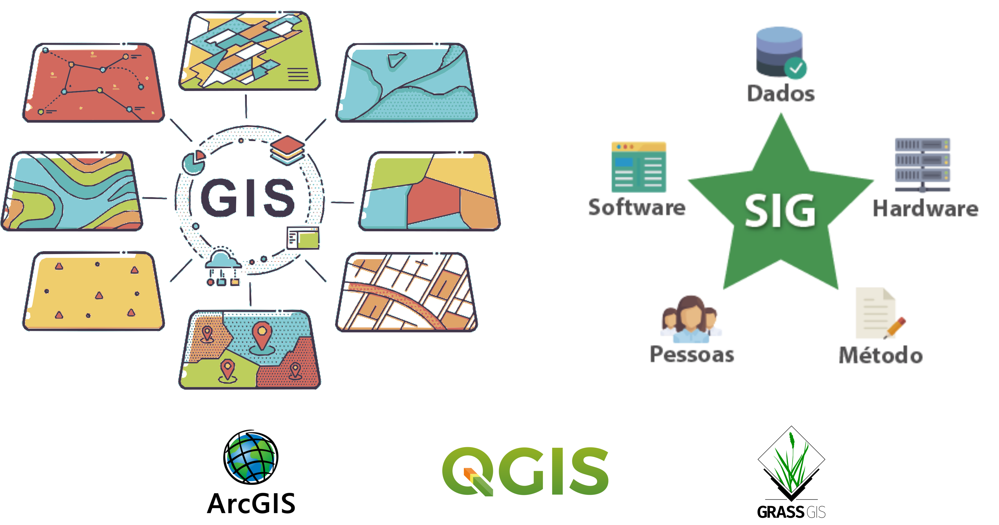
</center>

:::footer
[Geographic Information System](https://ankageo.com/en/information/geographic-information-system/), [SIG](https://www.eosconsultores.com.br/sig-funcionalidades-no-saneamento-basico/), [ArcGIS](https://www.esri.com/pt-br/home), [QGIS](https://qgis.org/pt_BR/site/), [GRASS GIS](https://grass.osgeo.org/)
:::

---

### Sistema de Informação Geográfica (SIG/GIS)

### QGIS 

<center>
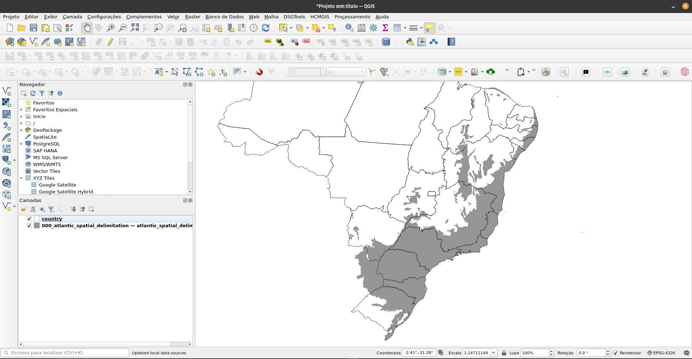
</center>

:::footer
[QGIS](https://qgis.org/pt_BR/site/)
:::

---

### Sistema de Informação Geográfica (SIG/GIS)

### GRASS GIS 

<center>
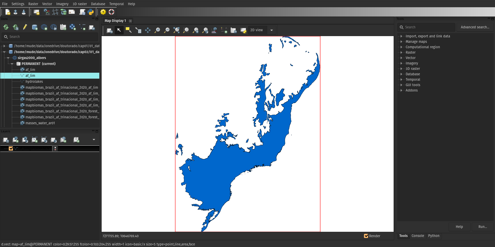
</center>

:::footer
[GRASS GIS](https://grass.osgeo.org/)
:::

# Dados geoespaciais

## Dados geoespaciais

::: columns
::: {.column width="60%"}
<center>
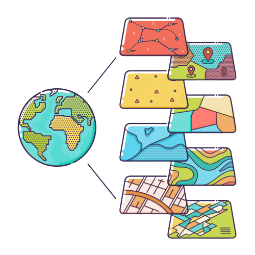
</center>
:::

::: {.column width="40%"}
<center>
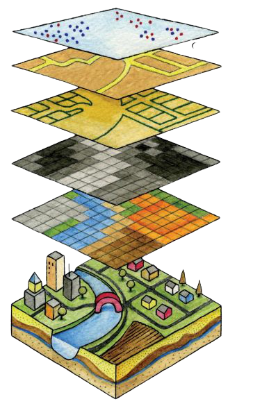
</center>
:::
:::

:::footer
[StartDee](https://blog.startdee.com/%E0%B8%A14-6-%E0%B8%A0%E0%B8%B9%E0%B8%A1%E0%B8%B4%E0%B8%A8%E0%B8%B2%E0%B8%AA%E0%B8%95%E0%B8%A3%E0%B9%8C-%E0%B8%A3%E0%B8%B0%E0%B8%9A%E0%B8%9A%E0%B8%AA%E0%B8%B2%E0%B8%A3%E0%B8%AA%E0%B8%99%E0%B9%80%E0%B8%97%E0%B8%A8%E0%B8%A0%E0%B8%B9%E0%B8%A1%E0%B8%B4%E0%B8%A8%E0%B8%B2%E0%B8%AA%E0%B8%95%E0%B8%A3%E0%B9%8C), [Campbell & Shin (2012)](https://2012books.lardbucket.org/books/geographic-information-system-basics/index.html)
:::

## Dados geoespaciais

<center>
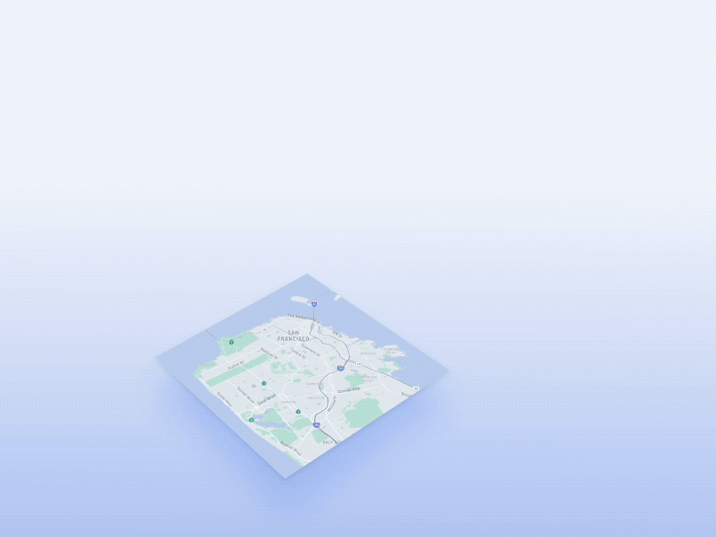
</center>

:::footer
[7 GIS terms To Know: Map Making for Designers](https://www.avenza.com/blog/2019/11/)
:::

## Dados vetoriais

Pontos, linhas e polígonos

<center>
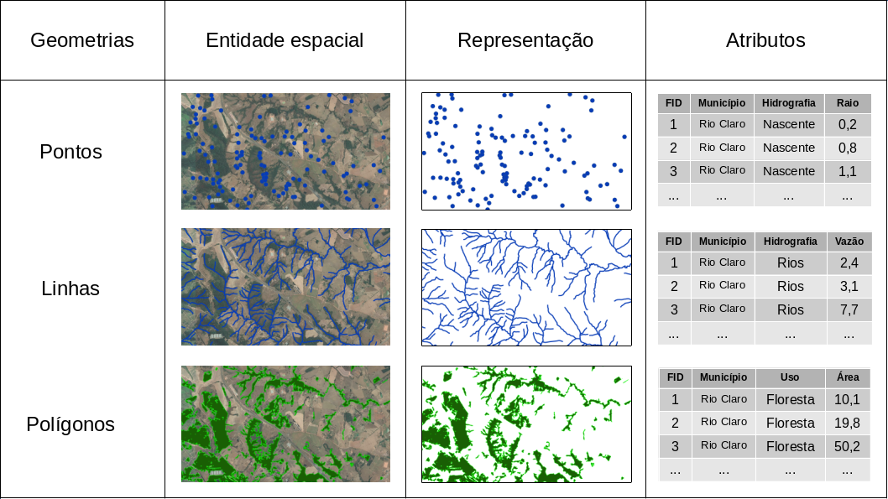
</center>

:::footer
[Da Silva et al. (2022)](https://analises-ecologicas.com/)
:::

## Dados vetoriais

Tabela de atributos

<center>
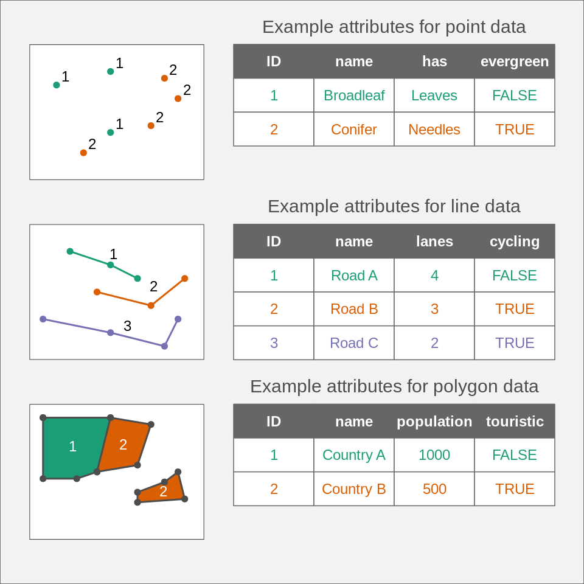
</center>

:::footer
[Tennekes & Nowosad (in prep.)](https://r-tmap.github.io/tmap-book/index.html)
:::

## Dados vetoriais {.smaller}

Formato: Shapefile

**.shp**: contém as informações da feição (desenho)

**.dbf**: tabela que contém as informações (colunas) sobre cada feição (linhas)

**.shx**: arquivo de índice que une o .shp ao .dbf

**.prj**: contém as informações do sistema de referências de coordenadas

<br><br>
<center>

</center>

:::footer
[Tennekes & Nowosad (in prep.)](https://r-tmap.github.io/tmap-book/index.html)
:::

## Dados matriciais (Raster)

Matriz de valores

<center>
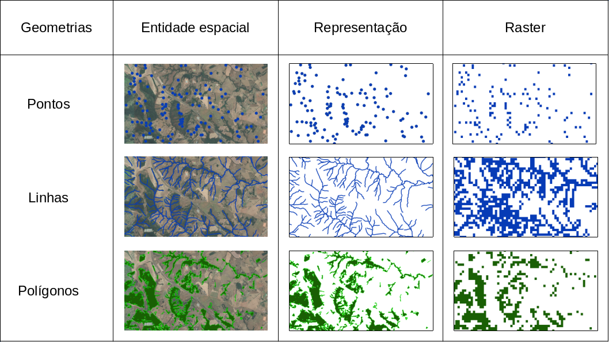
</center>

:::footer
[Da Silva et al. (2022)](https://analises-ecologicas.com/)
:::

## Dados matriciais (Raster)

Matriz de valores - contínuos ou categóricos

<br>
<center>
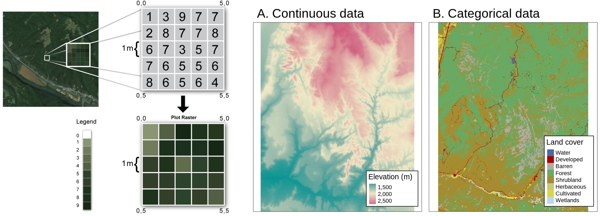
</center>

:::footer
[Lovelace et al. (2020)](https://geocompr.robinlovelace.net/), [National Ecological Observatory Network (NEON)](https://www.neonscience.org/resources/learning-hub/tutorials/dc-raster-data-r)
:::

## Dados matriciais (Raster)

Propriedades - extensão e resolução

<center>
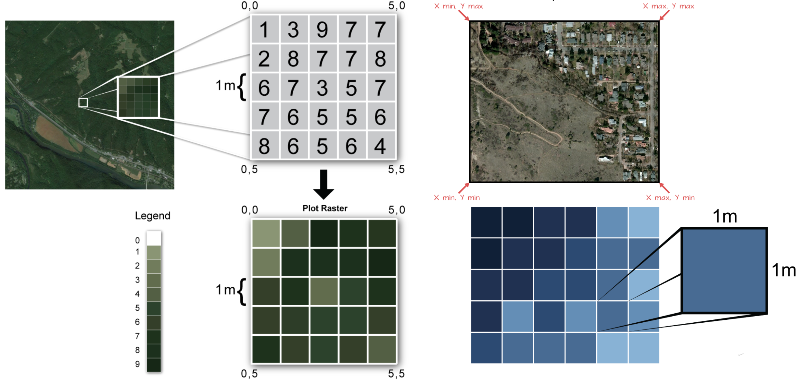
</center>

:::footer
[National Ecological Observatory Network (NEON)](https://www.neonscience.org/resources/learning-hub/tutorials/dc-raster-data-r)
:::

## Dados matriciais (Raster)

Formato: GeoTiff

**.tif**: arquivo raster georreferenciado

<center>
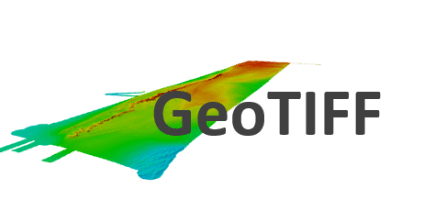
</center>

:::footer
[LuminFire Developers](https://luminfire.com/technologies/geotiff/), [GeoTIFF](https://trac.osgeo.org/geotiff)
:::

## Banco de dados geoespaciais

Formato: GeoPackage

**.gpkg**: arquivo de bando de dados geoespaciais

<center>
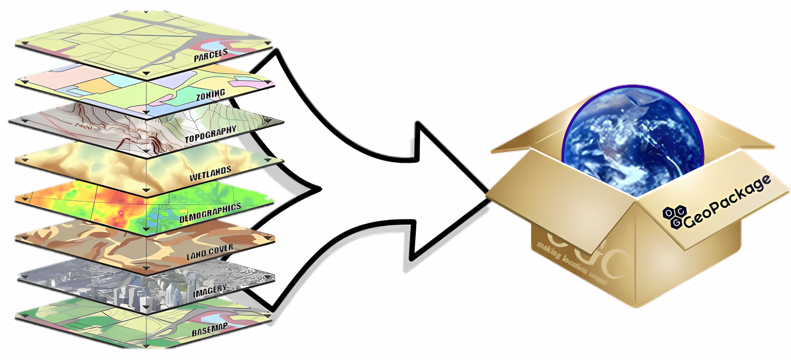
</center>

:::footer
[GeoPackage](https://www.geopackage.org/)
:::

## Conversão de dados geoespaciais

Converter vetor-raster e vice-versa

<center>
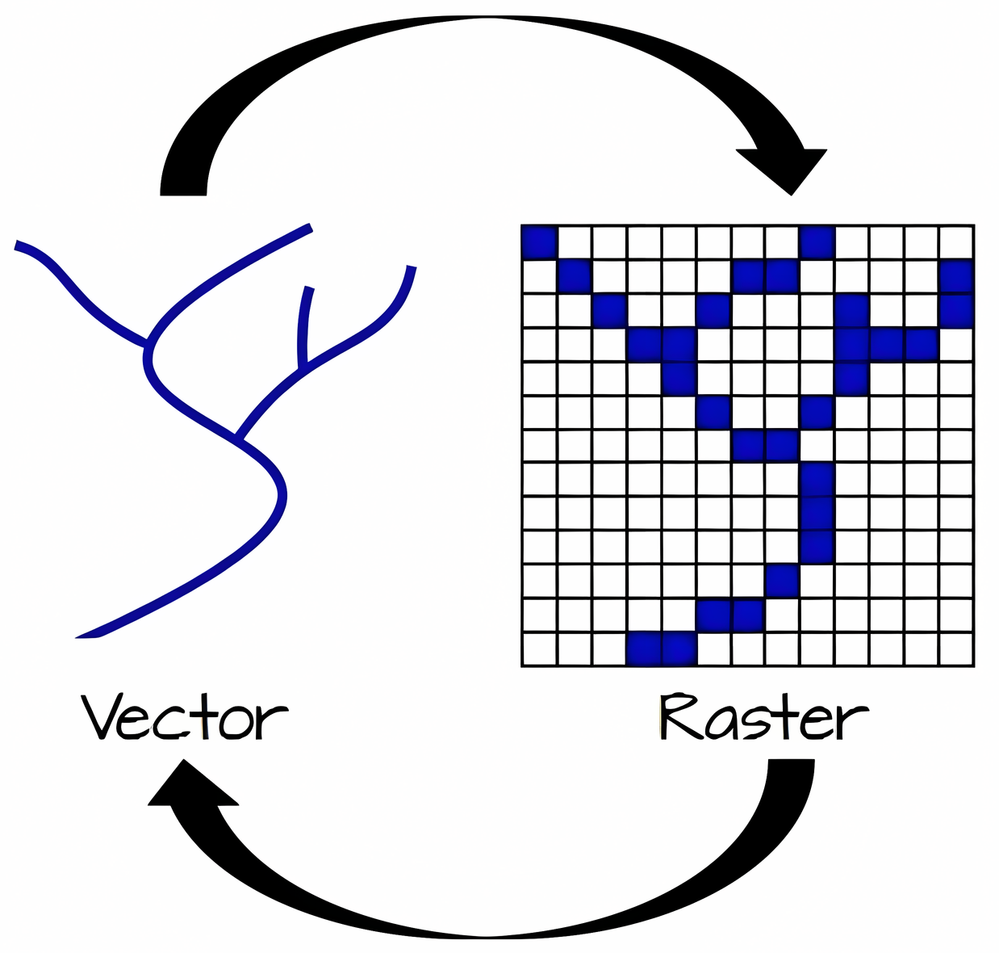
</center>

:::footer
[Tennekes & Nowosad (in prep.)](https://r-tmap.github.io/tmap-book/index.html)
:::

## Fontes de dados geoespaciais {.smaller .scrollable}

### Vetoriais

-  **[IBGE](https://www.ibge.gov.br/geociencias/downloads-geociencias.html)**: limites territoriais e censitários do Brasil
-  **[FBDS](http://geo.fbds.org.br)**: uso da terra, APP e hidrografia -  Mata Atlântica e Cerrado
-  **[GeoBank](http://geosgb.cprm.gov.br/)**: dados geológicos do Brasil
-  **[Pastagem.org](http://maps.lapig.iesa.ufg.br)**: dados de pastagens e gado para o Brasil
-  **[CanaSat](http://www.dsr.inpe.br/laf/canasat/)**: dados de cana-de-açúcar para o Brasil
-  **[CSR Maps](http://maps.csr.ufmg.br)**: diversos dados vetoriais para o Brasil
-  **[OpenStreetMap Data Extracts](http://download.geofabrik.de/index.html)**: dados do OpenStreetMap
-  **[Ecoregions](https://ecoregions2017.appspot.com/)**: dados de biorregiões e biomas do mundo  
-  **[GADM](https://gadm.org/)**: limites de áreas administrativas do mundo
-  **[Natural Earth](https://www.naturalearthdata.com/):** diversos limites para o mundo
-  **[Protected Planet](https://www.protectedplanet.net/en):** áreas protegidas para o mundo
-  **[UN Biodiversity Lab](https://www.unbiodiversitylab.org/)**: Diversas bases de dados para o mundo
-  **[HydroSHEDS](https://www.hydrosheds.org/)**: informações hidrológicas do mundo
-  **[Global Roads Inventory Project (GRIP)](https://www.globio.info/download-grip-dataset)**: dados de estradas do mundo todo 

:::footer
[Lista completa](https://mauriciovancine.github.io/blog/geodados-fonte/)
:::

## Fontes de dados geoespaciais {.smaller .scrollable}

### Matriciais

-  **[MapBiomas](https://mapbiomas.org)**: uso e cobertura da terra para o Brasil, diversos anos
-  **[Bahlu](ftp://madeira.dea.ufv.br/bdados/bhalu/)**: Distribuições históricas de terras agrícolas e pastagens para todo o Brasil de 1940 a 2012
-  **[USGS](https://www.usgs.gov)**: dados de diversos satélites livres para o mundo
-  **[SRTM](http://srtm.csi.cgiar.org/)**: dados de elevação para o mundo
-  **[Global Forest Watch](https://www.globalforestwatch.org/)**: dados de uso e cobertura para todo o planeta
-  **[Geoservice Maps](https://geoservice.dlr.de/web/maps)**: dados de elevação e florestas para o mundo
-  **[GlobCover](http://due.esrin.esa.int/page_globcover.php)**: dados de uso e cobertura da terra para todo o planeta
-  **[Global Human Footprint](https://wcshumanfootprint.org/)**: dados de pegada ecológica para o mundo
-  **[Land-Use Harmonization (LUH2)](https://luh.umd.edu/)**: dados atuais e previsões de uso da terra
-  **[SoilGrids](https://soilgrids.org/)**: dados de solo para o mundo                         
-  **[WorldClim](https://www.worldclim.org/)**: dados climáticos para o mundo
-  **[CHELSA](https://chelsa-climate.org/)**: dados climáticos para o mundo
-  **[EarthEnv](https://www.earthenv.org/)**: dados de cobertura da terra, nuvens, relevo e hidrografia
-  **[MARSPEC](http://www.marspec.org)**: dados de condições do oceano para o mundo
-  **[Bio-ORACLE](https://www.bio-oracle.org/)**: dados de condições do oceano para o mundo   

:::footer
[Lista completa](https://mauriciovancine.github.io/blog/geodados-fonte/)
:::

## Fontes de dados geoespaciais {.smaller .scrollable}

### Pacotes R e sites

-  **[geobr](https://cran.r-project.org/web/packages/geobr/index.html)**: carrega Shapefiles de Conjuntos de Dados Espaciais Oficiais do Brasil
-  **[rnaturalearth](https://cran.r-project.org/web/packages/rnaturalearth/index.html)**: dados do mapa mundial da Natural Earth
-  **[geodata](https://cran.r-project.org/web/packages/geodata/index.html)**: acesso a dados globais de clima, altitude, solo, ocorrência de espécies e limites administrativos
-  **[rworldmap](https://cran.r-project.org/web/packages/rworldmap/index.html)**: dados globais
-  **[spData](https://cran.r-project.org/web/packages/spData/index.html)**: conjuntos de dados para análise espacial
-  **[OpenStreetMap](https://cran.r-project.org/web/packages/OpenStreetMap/index.html)**: acesso para abrir imagens raster de mapas de ruas
-  **[osmdata](https://cran.r-project.org/web/packages/osmdata/index.html)**: baixe e importe dados do OpenStreetMap
-  **[geonames](https://cran.r-project.org/web/packages/geonames/index.html)**: interface para o serviço da Web de consulta espacial "Geonames"
-  **[rgbif](https://cran.r-project.org/web/packages/rgbif/index.html)**: interface para o Global 'Biodiversity' Information Facility API
-  **[maptools](https://cran.r-project.org/web/packages/maptools/index.html)**: ferramentas para lidar com objetos espaciais
-  **[marmap](https://cran.r-project.org/web/packages/marmap/index.html)**: importar, traçar e analisar dados batimétricos e topográficos
-  **[envirem](https://cran.r-project.org/web/packages/envirem/index.html)**: geração de Variáveis ENVIREM
-  **[sdmpredictors](https://cran.r-project.org/web/packages/sdmpredictors/index.html)**: conjuntos de dados preditor de modelagem de distribuição de espécies
-  **[rstac](https://github.com/brazil-data-cube/rstac)**: R Client Library for SpatioTemporal Asset Catalog
-  **[rwlts](https://github.com/brazil-data-cube/rwlts)**: R Client Library for Web Land Trajectory Service 
-  **[getSpatialData](https://jakob.schwalb-willmann.de/getSpatialData/)**: baixar diversas bases de dados
-  **[rspatialdata](https://rspatialdata.github.io/index.html)**: coleção de fontes de dados e tutoriais sobre a visualização de dados espaciais usando R

:::footer
[Lista completa](https://mauriciovancine.github.io/blog/geodados-fonte/)
:::

# Prática

## R

O R é uma **linguagem de programação livre** (*open source*), direcionada à **manipulação, análise e visualização de dados**, com diversas **expansões** (*pacotes*) para operações e análises **específicas** 

<center>

</center>

:::footer
[R](https://www.r-project.org/)
:::

## RStudio

IDE (*Integrated Development Environment*) ou Ambiente de Desenvolvimento Integrado 

<center>
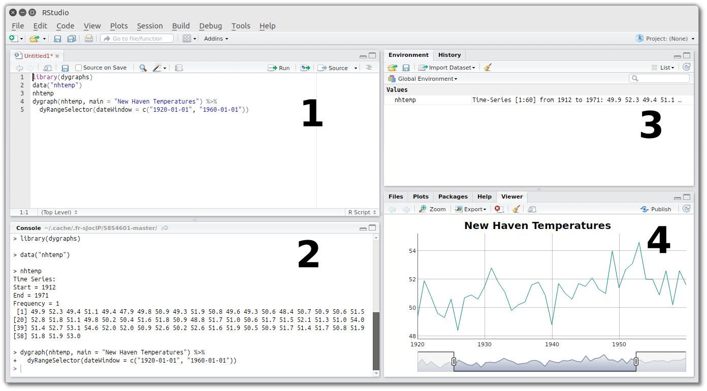
</center>

:::footer
[RStudio](https://www.rstudio.com/)
:::

# Pacotes

## Pacotes (Hijmans team)

<br>
<center>

</center>

:::footer
[terra](https://rspatial.github.io/terra/reference/terra-package.html)
:::

## Pacotes (Pebesma team)

::: columns
::: {.column width="50%"}
<br>
<center>

</center>
:::

::: {.column width="50%"}
<br><br><br>
<center>
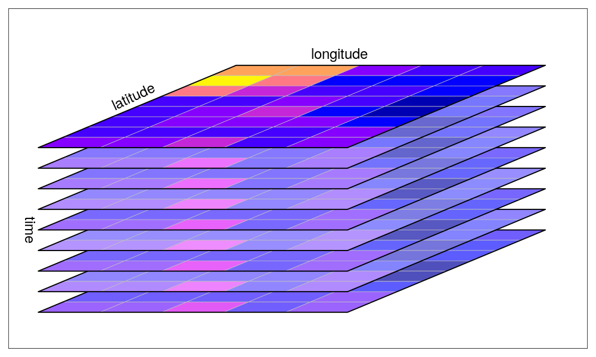
</center>
:::
:::

:::footer
[sf](https://r-spatial.github.io/sf/), [stars](https://r-spatial.github.io/stars/index.html)
:::

## Pacotes (Tennekes team)

<br>
<center>
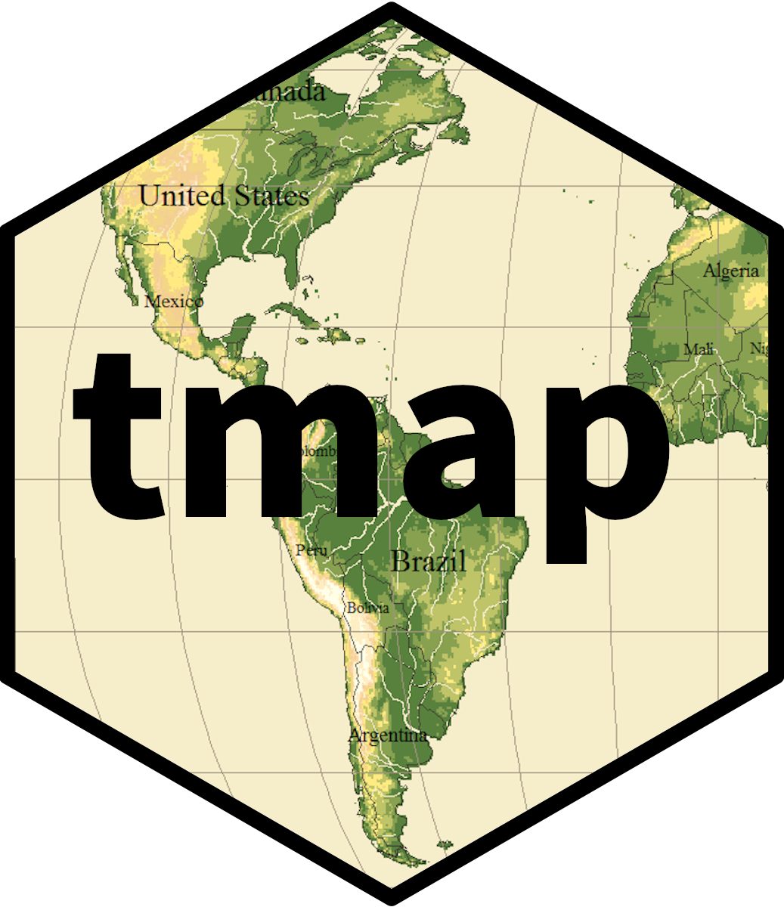
</center>

:::footer
[tmap](https://r-tmap.github.io/tmap/)
:::

## Pacotes (IPEA team)

<br>
<center>
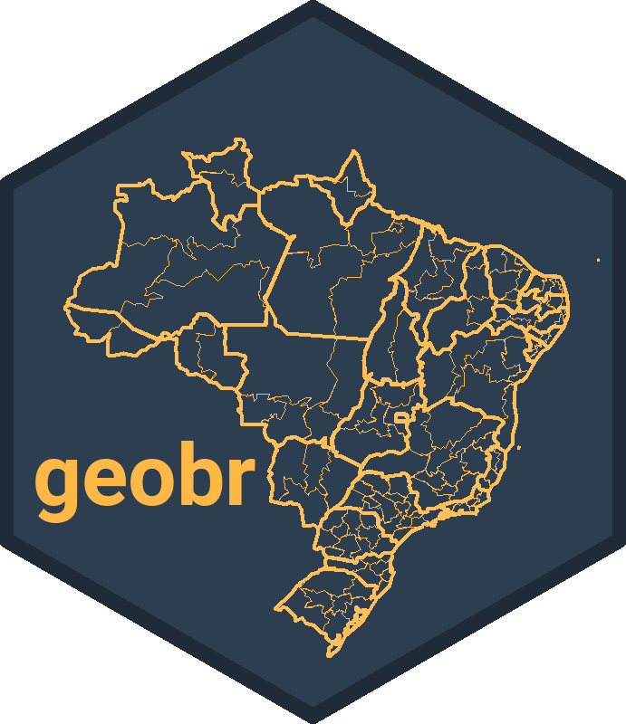
</center>

:::footer
[geobr](https://r-tmap.github.io/tmap/)
:::

# Dados

## MapBiomas 10 m

<center>
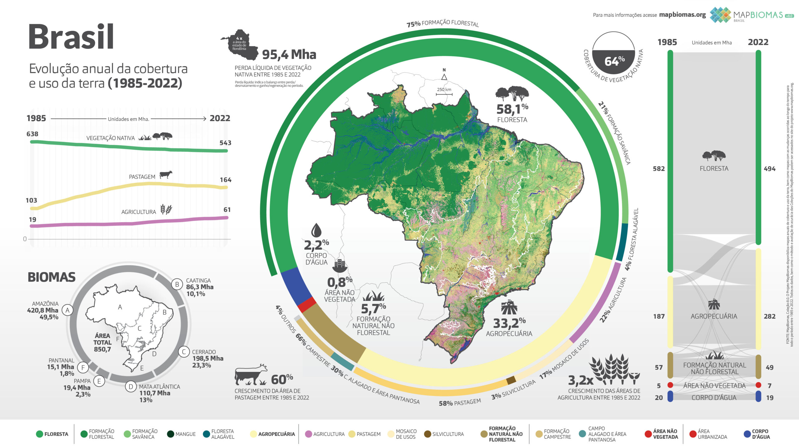
</center>

:::footer
[MapBiomas](https://brasil.mapbiomas.org/), [Souza et al. (2020)](https://www.mdpi.com/2072-4292/12/17/2735)
:::

## WorldClim 2.1

<center>
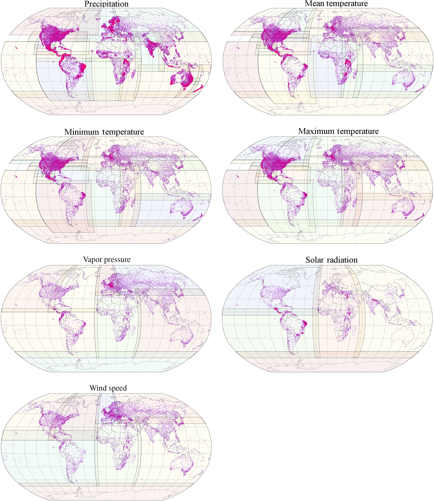
</center>

:::footer
[WorldClim](https://www.worldclim.org/), [Fick & Hijmans (2017)](https://rmets.onlinelibrary.wiley.com/doi/full/10.1002/joc.5086)
:::

## WorldClim 2.1

<center>
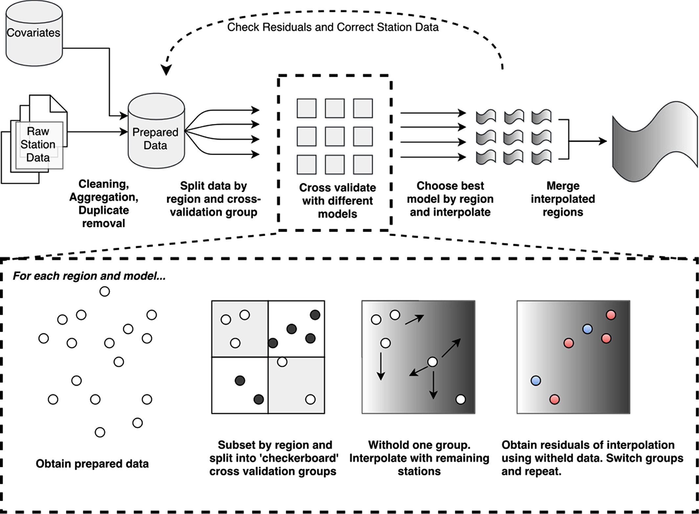
</center>

:::footer
[WorldClim](https://www.worldclim.org/), [Fick & Hijmans (2017)](https://rmets.onlinelibrary.wiley.com/doi/full/10.1002/joc.5086)
:::

# Reprojeção

## Reprojeção

<br>
**Vetor**

<center>
<br>
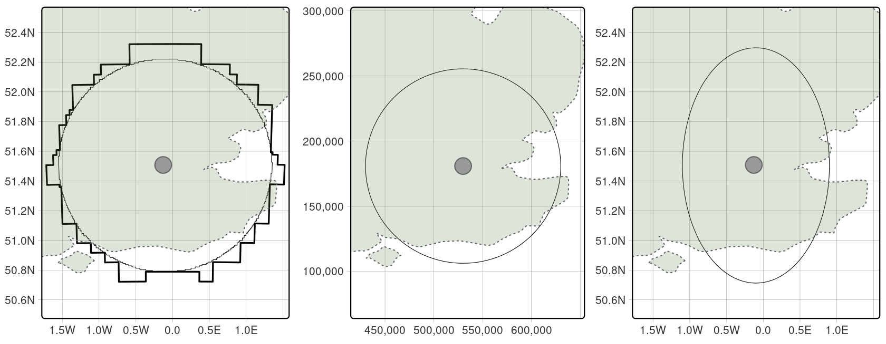
</center>

:::footer
[Lovelace et al. (2024)](https://r.geocompx.org/)
:::

## Reprojeção

<br>
**Raster**

<center>
<br>
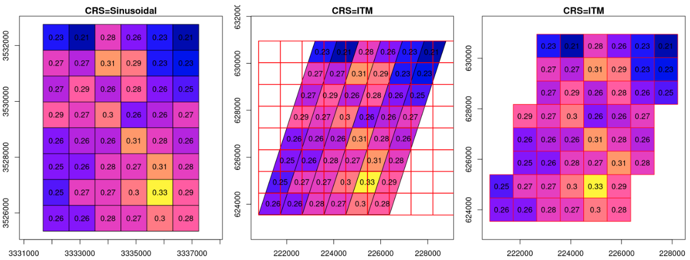
</center>

:::footer
[Dorman (2022)](https://geobgu.xyz/r-2022/index.html)
:::

# Operações

## Extração de dados para pontos

<center>
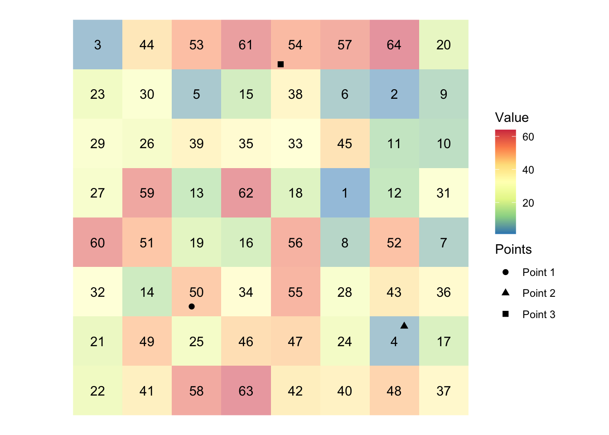
</center>

:::footer
[R as GIS for Economists](https://tmieno2.github.io/R-as-GIS-for-Economists/)
:::

## Reamostragem de raster

<center>
<br>
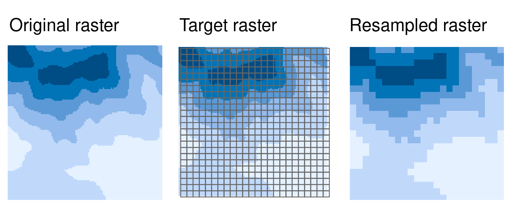
</center>

:::footer
[Lovelace et al. (2024)](https://r.geocompx.org/)
:::

## Reamostragem de raster

<center>
<br><br><br>
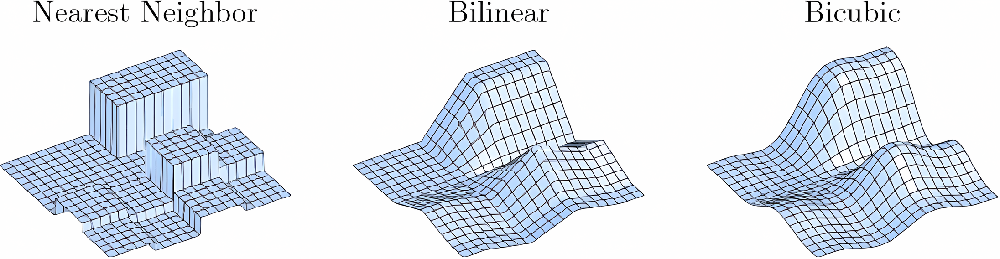
</center>

:::footer
[Getreuer et al. (2011)](https://doi.org/10.5201/ipol.2011.g_lmii)
:::

## Máscara de raster por um vetor

<center>
<br><br>
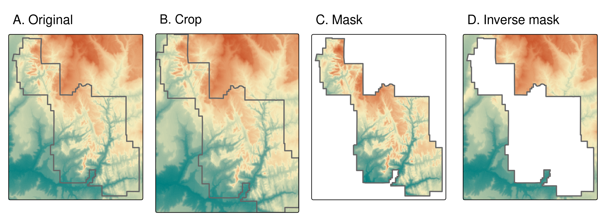
</center>

:::footer
[Lovelace et al. (2024)](https://r.geocompx.org/)
:::

## Buffer

::: columns
::: {.column width="45%"}
<br>
<center>
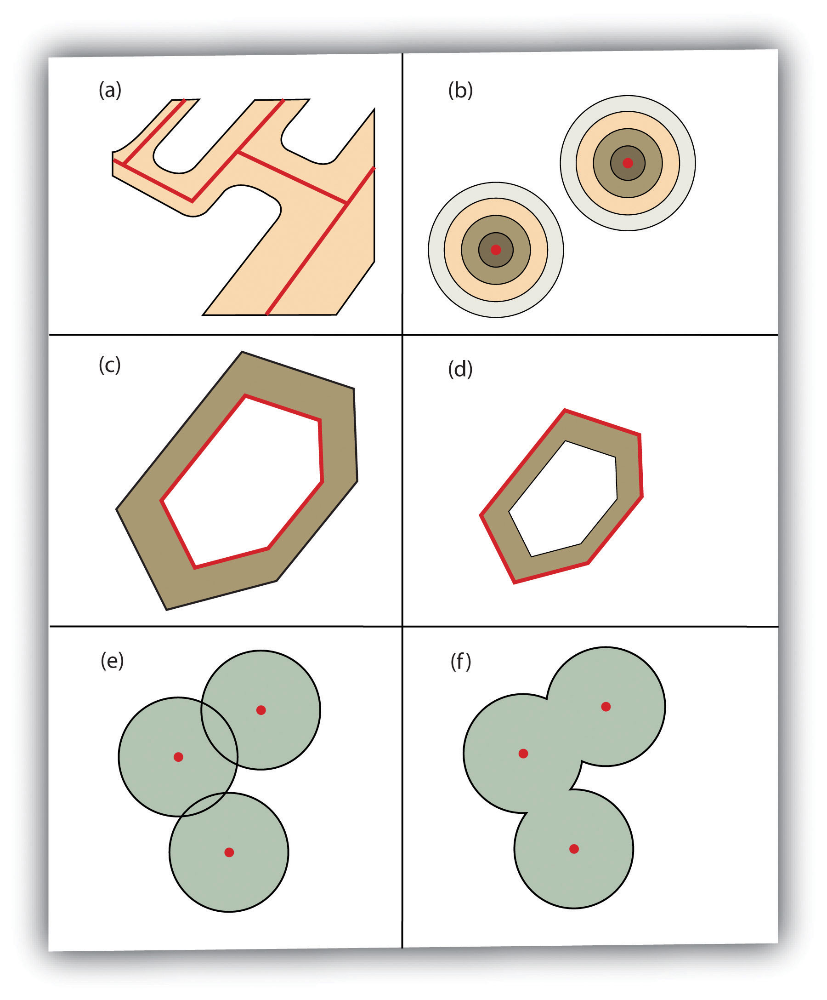
</center>
:::

::: {.column width="55%"}
<br><br><br>
<center>

</center>
:::
:::

:::footer
[Geographic Information Systems and Cartography](https://slcc.pressbooks.pub/maps/), [ArcGIS](https://desktop.arcgis.com/en/arcmap/latest/tools/analysis-toolbox/buffer.htm)
:::

# Mapas

## Tipos de mapas no tmap

### Estático

```{r fig.align='center'}
library(tmap)
library(spData)

tmap_mode(mode = "plot")

map_nz <- tm_shape(nz) + tm_polygons()
map_nz
```

:::footer
[tmap](https://r-tmap.github.io/tmap/)
:::

## Tipos de mapas no tmap

### Interativo

```{r eval=FALSE}
tmap_mode(mode = "view")
map_nz
```
```{r fig.align='center',echo=FALSE}
knitr::include_url("img/map.html")
```

:::footer
[tmap](https://r-tmap.github.io/tmap/)
:::

# Aplicações

## Dinâmica espaço-temporal da vegetação da Mata Atlântica

<br>
<center>
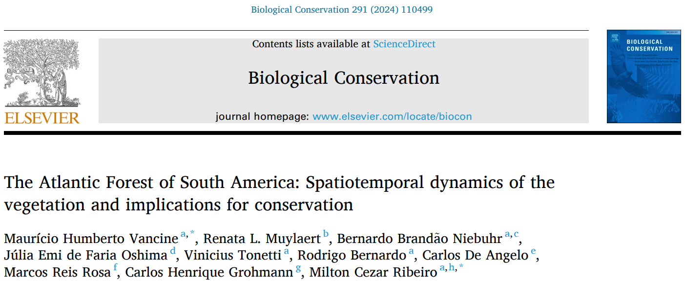
</center>

:::footer
[Vancine et al. (2024)](https://doi.org/10.1016/j.biocon.2024.110499)
:::

## Dinâmica espaço-temporal da vegetação da Mata Atlântica

::: columns
::: {.column width="50%"}
<br>
<center>
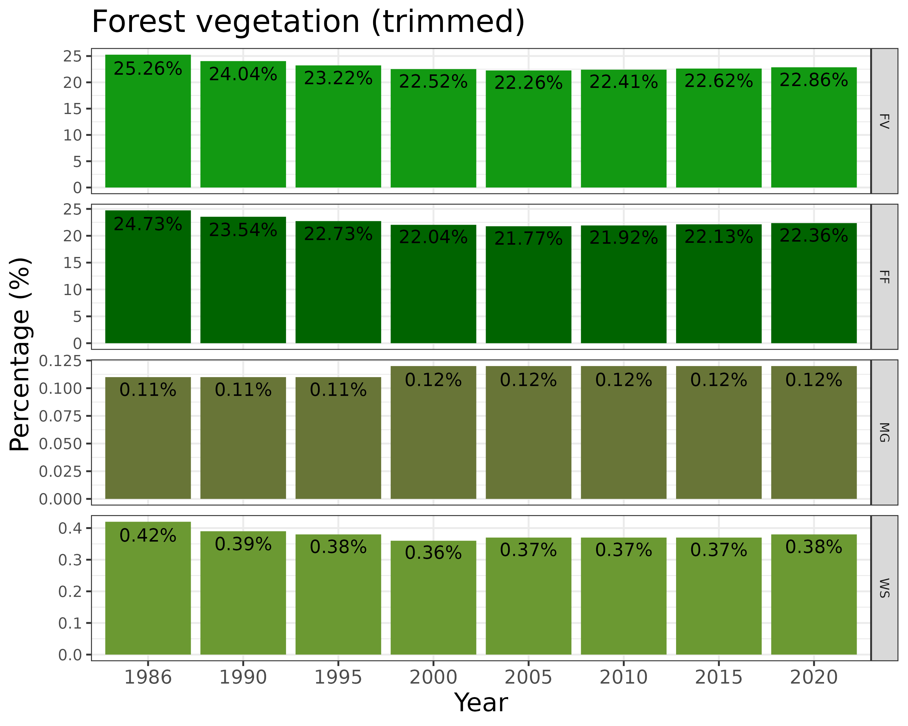
</center>
:::

::: {.column width="50%"}
<center>
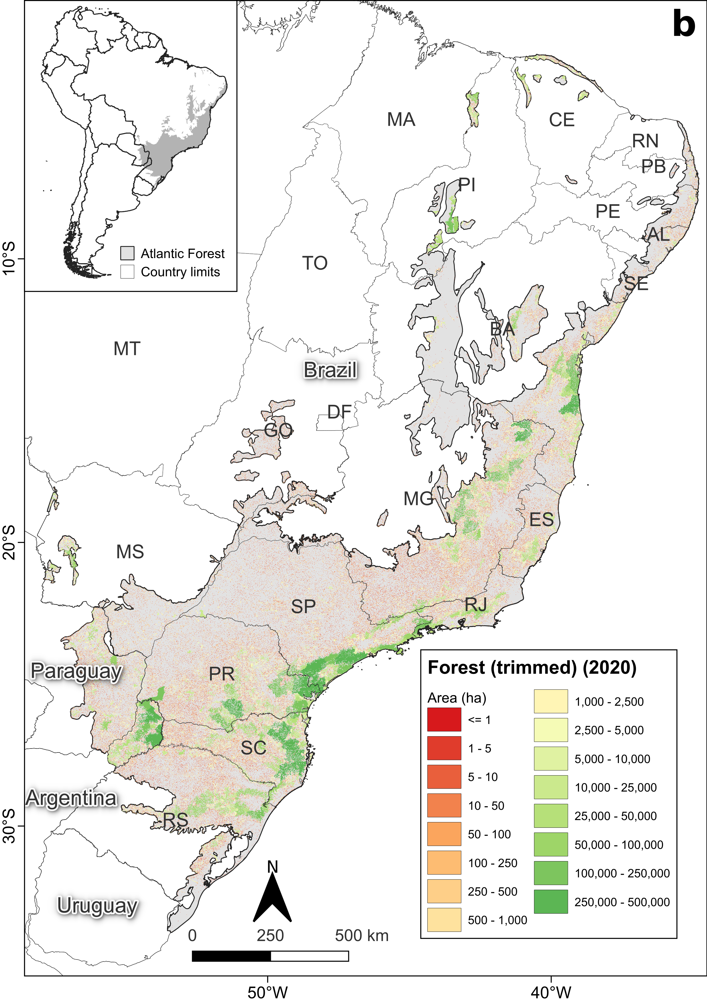
</center>
:::
:::

:::footer
[Vancine et al. (2024)](https://doi.org/10.1016/j.biocon.2024.110499)
:::

## ATLANTIC SPATIAL

500 rasters de paisagem, topografia, hidrologia e antrópicas

<center>
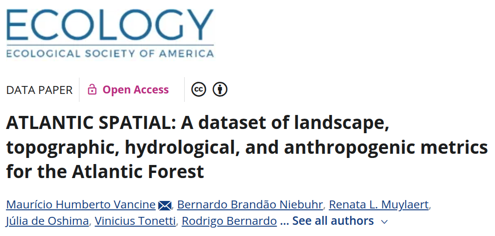
</center>

:::footer
[Vancine et al. (2026)](https://doi.org/10.1016/j.biocon.2024.110499)
:::

## ATLANTIC SPATIAL

Pacote no R: [atlanticr](https://mauriciovancine.github.io/atlanticr/)

::: columns
::: {.column width="60%"}
<center>
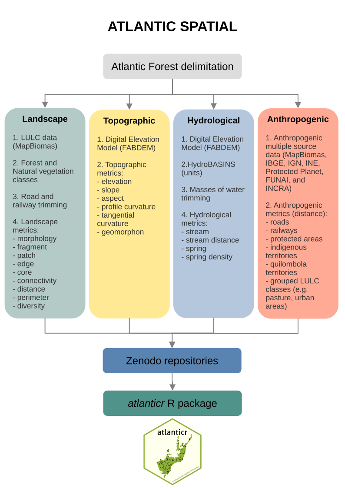
</center>
:::

::: {.column width="40%"}
<center>
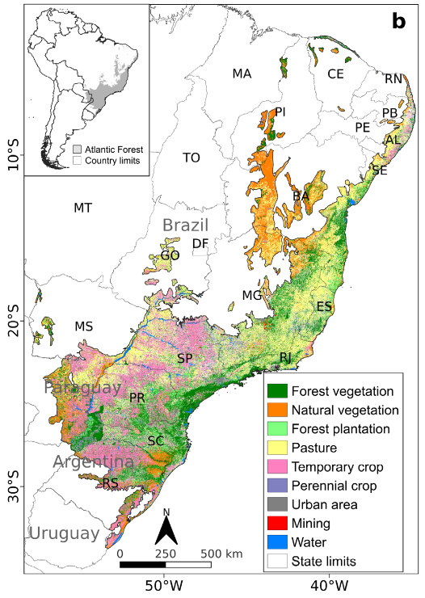
</center>
:::
:::

:::footer
[Vancine et al. (2026)](https://doi.org/10.1016/j.biocon.2024.110499)
:::

## ATLANTIC SPATIAL

Métricas de paisagem espacializadas para a Mata Atlântica

<center>
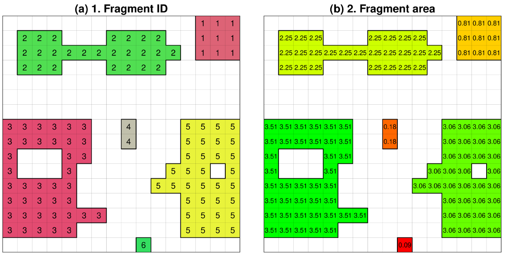
</center>

:::footer
[Vancine et al. (2026)](https://doi.org/10.1016/j.biocon.2024.110499)
:::

# Para saber mais

## Análises Ecológicas no R

::: columns
::: {.column width="40%"}
<br><br>
<center>

</center>
:::

::: {.column width="60%"}
<br>

- 15 capítulos

- Linguagem R

- *tidyverse*

- Perguntas em ecologia

- Análises univariadas

- Análises multivariadas 

- Análises geoespaciais

:::
:::

:::footer
[Da Silva et al. (2022)](https://analises-ecologicas.com/)
:::

## Geocomputation with R

::: columns
::: {.column width="40%"}
<br><br>
<center>
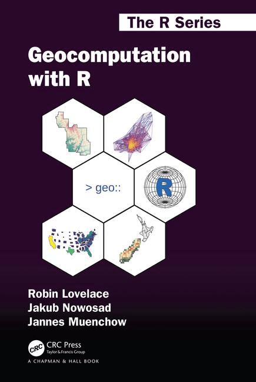
</center>
:::

::: {.column width="60%"}
<br>

- 16 capítulos

- Fundações (dados geográficos, operações, reprojeção e I/O)

- Extensões (mapas, GIS, programação e estatística)

- Aplicações (transporte, geomarketing e ecologia)

:::
:::

:::footer
[Lovelace et al. (2024)](https://r.geocompx.org/)
:::

## Spatial Data Science

::: columns
::: {.column width="40%"}
<br><br>
<center>
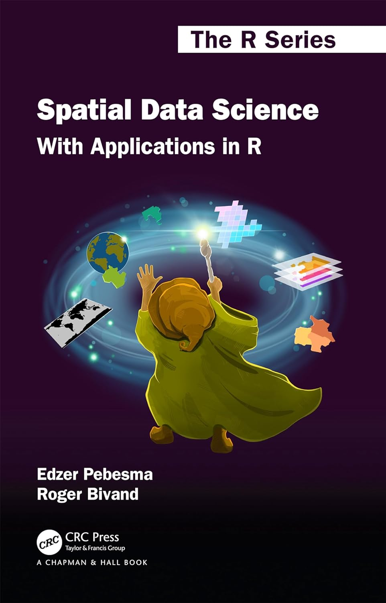
</center>
:::

::: {.column width="60%"}
- 17 capítulos

- Dados espaciais (coordenadas, geometrias, atributos e cubos)

- Ciência de dados espacial (sf, stars, mapas, grandes dados e nuvem)

- Modelos (estatistica, padrão de pontos, interpolação, geoestatística, proximidade, autocorrelação, regressão espacial, econometria)

:::
:::

:::footer
[Pebesma & Bivand (2023)](https://r-spatial.org/book/)
:::

## Geospatial Health Data: Modeling and Visualization with R-INLA and Shiny

::: columns
::: {.column width="40%"}
<br>
<center>
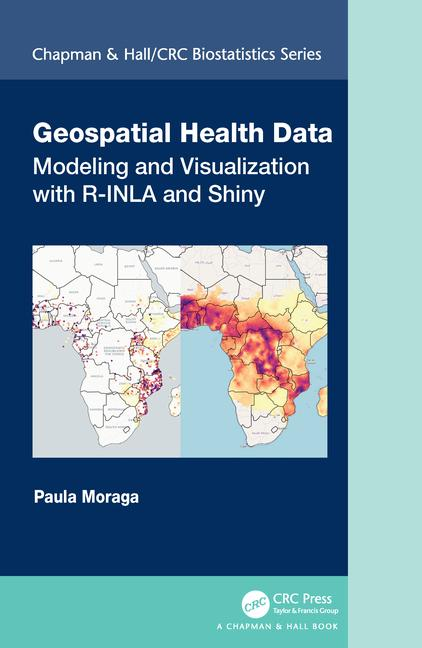
</center>
:::

::: {.column width="60%"}

<br>

- 16 capítulos

- Dados geoespaciais de saúde

- Modelagem e visualização

- Comunicação dos resultados

:::
:::

:::footer
[Moraga(2019)](https://www.paulamoraga.com/book-geospatial/)
:::

## Spatial Statistics for Data Science: Theory and Practice with R

::: columns
::: {.column width="40%"}
<br>
<center>
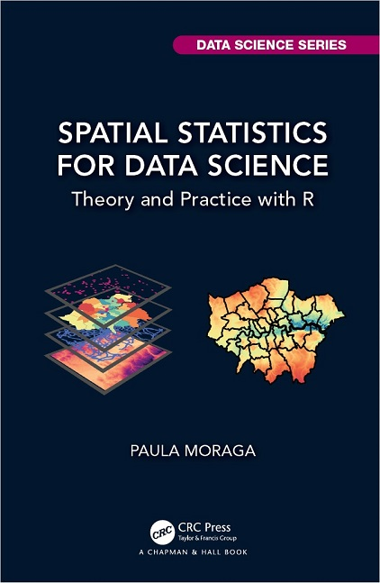
</center>
:::

::: {.column width="60%"}

<br>

- 23 capítulos

- Dados espaciais

- Dados aéreos

- Dados geoestatísticos

- Padrões de pontos espaciais

:::
:::

:::footer
[Moraga (2023)](https://www.paulamoraga.com/book-spatial/)
:::

## Brazil Data Cube

<center>
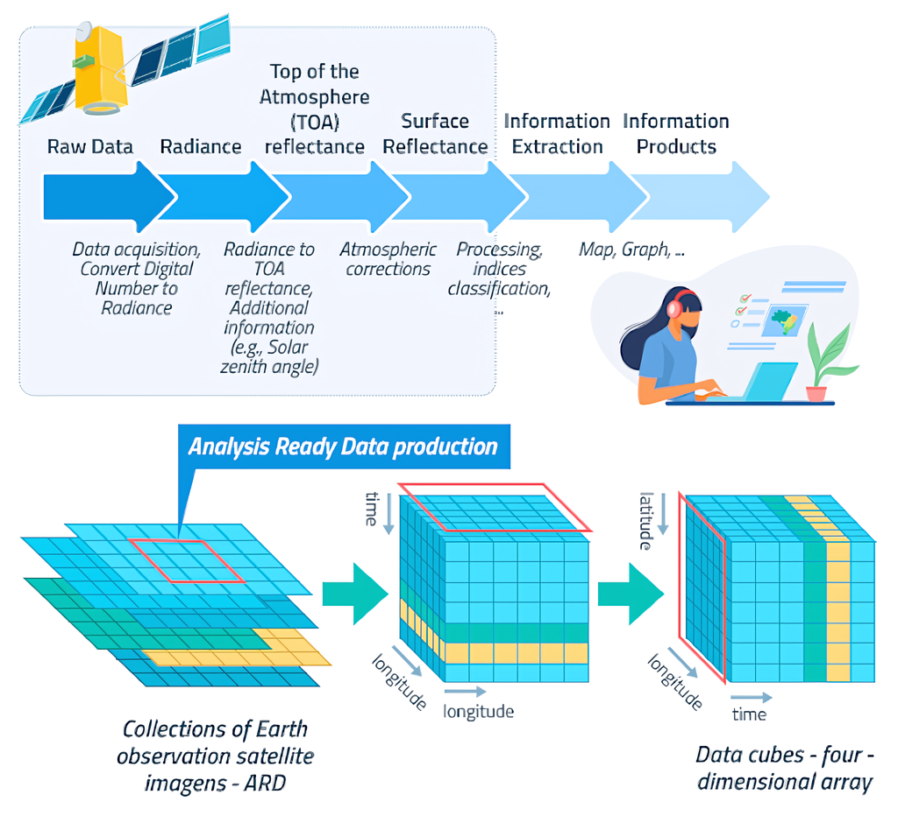
</center>

:::footer
[Brazil Data Cube](http://www.brazildatacube.org)
:::

## Brazil Data Cube

<center>
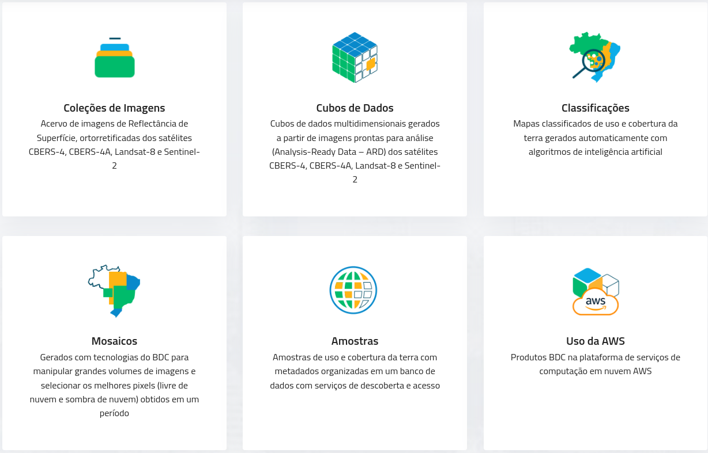
</center>

:::footer
[Brazil Data Cube](http://www.brazildatacube.org)
:::

## Brazil Data Cube

### SITS – Satellite Image Time Series Analysis for Earth Observation Data Cubes

::: columns
::: {.column width="40%"}
<br>
<center>

</center>
:::

::: {.column width="60%"}
<center>
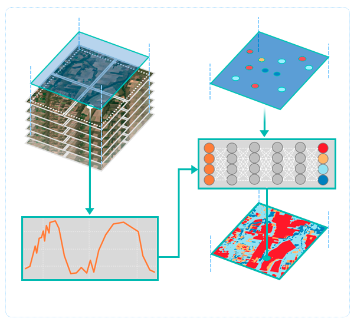
</center>

:::
:::

:::footer
[sits](http://www.brazildatacube.org/sits-satellite-image-time-series/)
:::

## Trabalhando com dados espaciais

### R-Ladies São Paulo e Brasília

Laís Brasileiro e Beatriz Milz

<center>

</center>

:::footer
[RLadies - Trabalhando com dados espaciais no R](https://r-ladies-sao-paulo.github.io/2023-12-dados-espaciais/)
:::

## Prática

[GitHub](https://github.com/grupo-estudos-r-estatistica/geospatial)

<center>

</center>

:::footer
[GitHub](https://github.com/grupo-estudos-r-estatistica/geospatial)
:::

# Dúvidas?

## Muito obrigado!

::::: columns
::: {.column width="50%"}
Agradecimentos:

- [Prof. Tadeu Siqueira](https://tsiqueiralab.weebly.com/)
- [Prof. Miltinho](https://leec.eco.br/)

{.absolute width=40% right=650 top=450}
:::

::: {.column width="50%"}
Contato:

<center>
[mauricio.vancine\@gmail.com]() [mauriciovancine.github.io](mauriciovancine.github.io)

</center>
:::
:::::

::: footer
Slides por [Maurício Vancine](https://mauriciovancine.github.io/), feitos com [Quarto](https://quarto.org/). Código disponível no [GitHub](https://github.com/mauriciovancine/workshop-r-introduction/blob/master/01_slides/slides.qmd).
:::